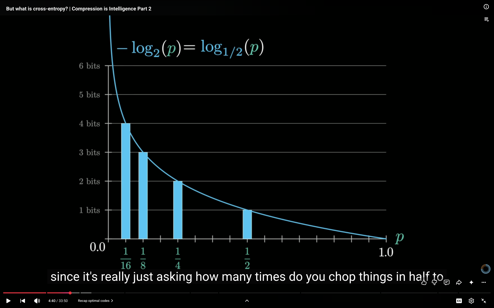
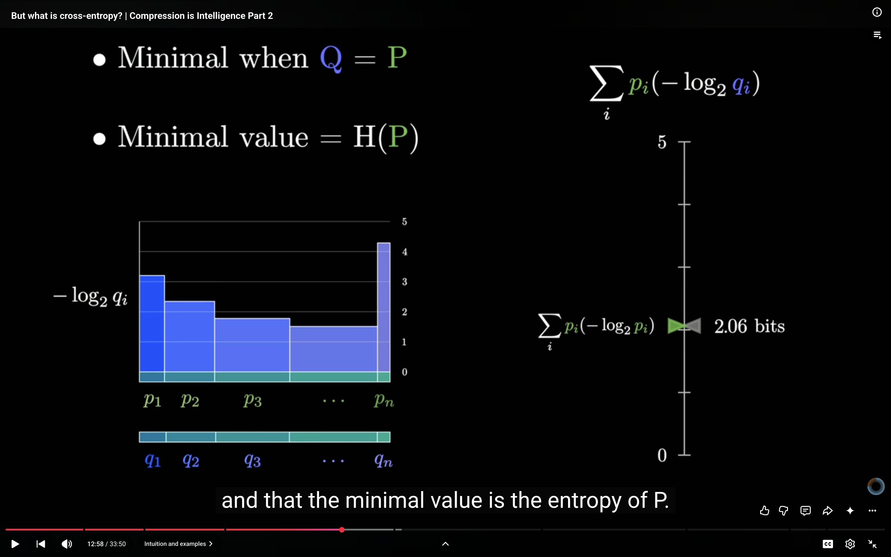
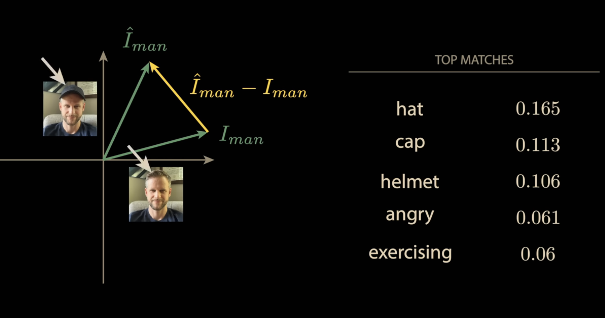
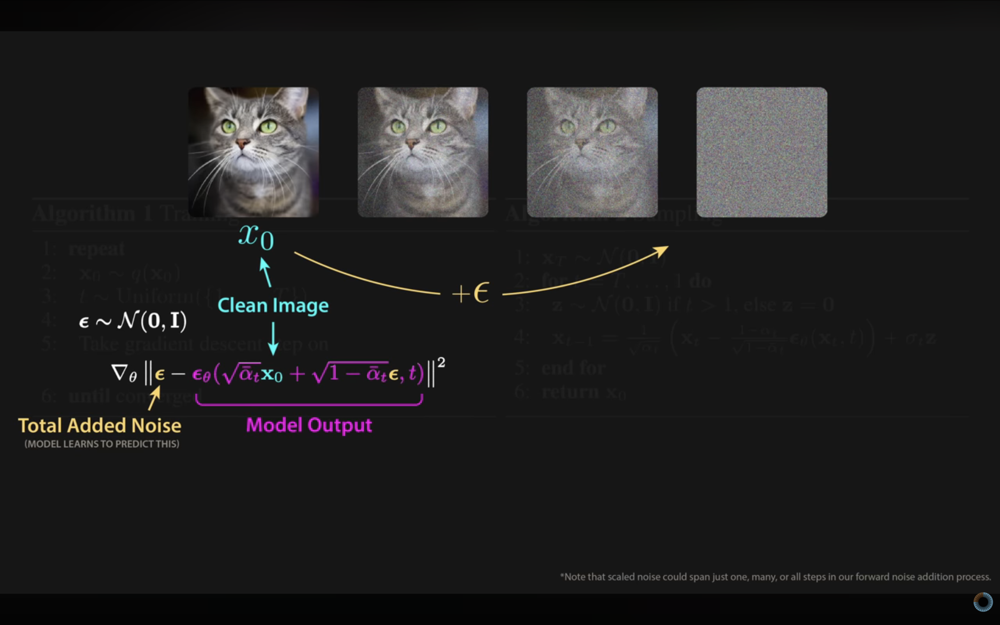
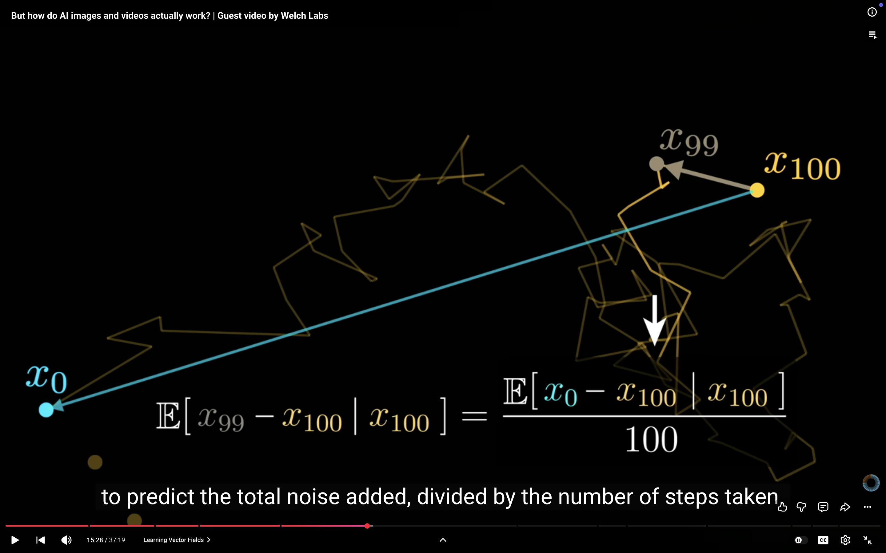
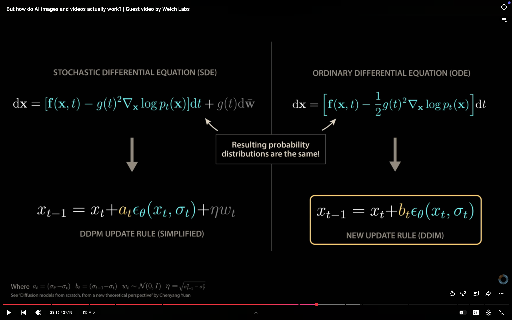
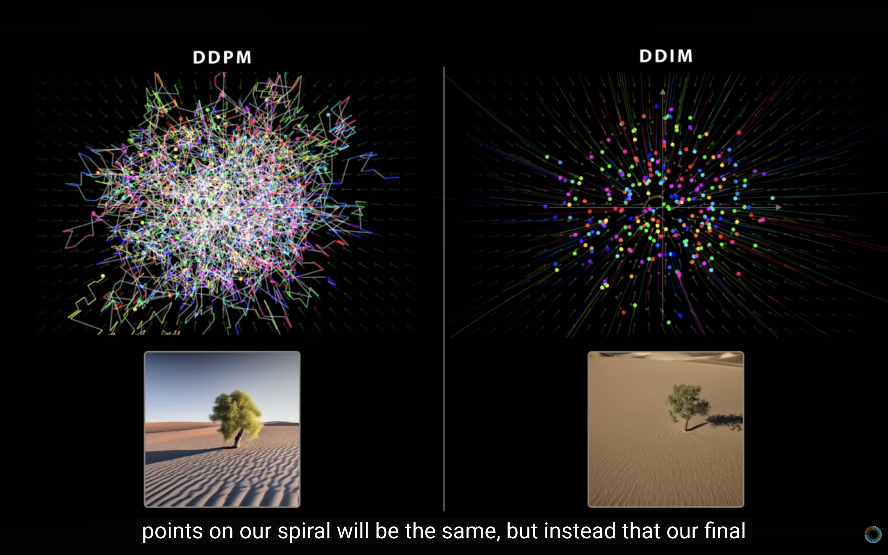
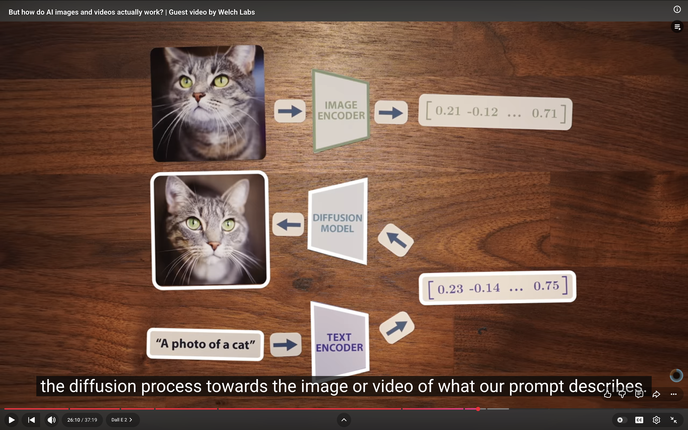
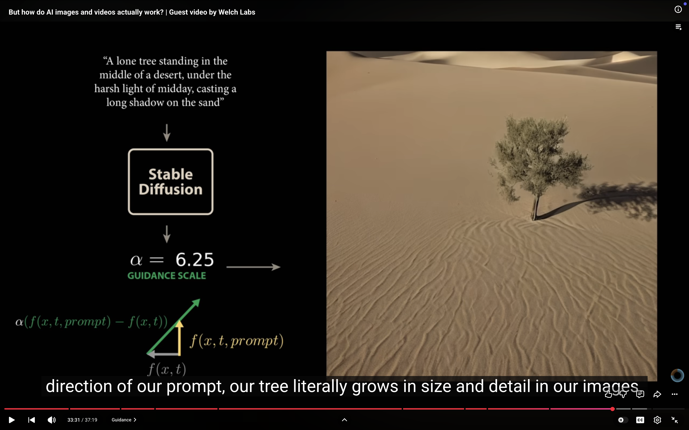

https://www.youtube.com/watch?v=aircAruvnKk&list=PLZHQObOWTQDNU6R1_67000Dx_ZCJB-3pi&index=2

chapter 9 : https://www.youtube.com/watch?v=GlYgs6v2YfU&list=PLZHQObOWTQDNU6R1_67000Dx_ZCJB-3pi&index=11

Number of bits allocalted to a symbol in a optimized encoder will will neagtive of log of probabily of occurance of that symbol.

https://www.youtube.com/watch?v=iv-5mZ_9CPY&list=PLZHQObOWTQDNU6R1_67000Dx_ZCJB-3pi&index=10

Diffusion models.
Brownien motion

split into image and ptext vectors.then minimizie the cosine similarity between same text and image pair and maximixe similaariy between non matching text and image.

denoising diffusion probabilistic models.
DDPM

How is adding random noise while generating images gives better quality ?

Diffusion models learn time varing vector feild .

score function poits us to moslt likely less noisly data point.

Not ading noise will lead all the points to capture only some part of distibution rather than capturing the whole distribution.

Sad blury tree ! (average of distrubution)

key issue with ddpn was high compute demand , large number of pass through large language model.

NEW PAPER from google and stanford.

DDPM isue was it needed a large pass through large language model and it was taking lots of steps .
SO DDIM was introducted ,( without adding random noise , step size is reduced it was able to produce good images in less number of steps).

DDPM : used physics equation: Fokker plank equation : stocastic differential equation.

DDIM : used ordinanary differential equation wathout random component

Our ability to guide image generation was limited through prompt was limited
DALI-2

Classifier free guidance .
we train two seperate one woth class information one without class information and take the dofference woth scaling factor (alpha)
--> fx(xi,t,cat)- f(xi,t,no class).

 