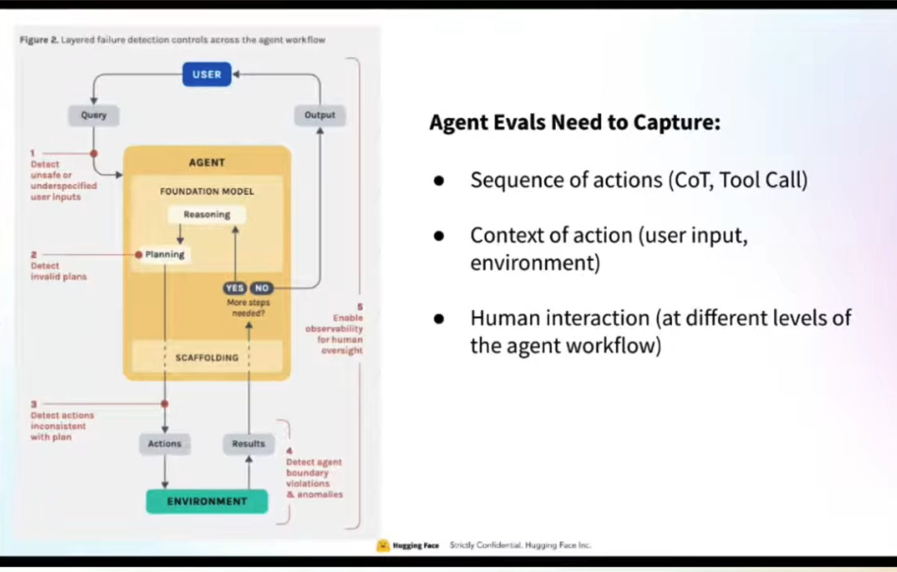
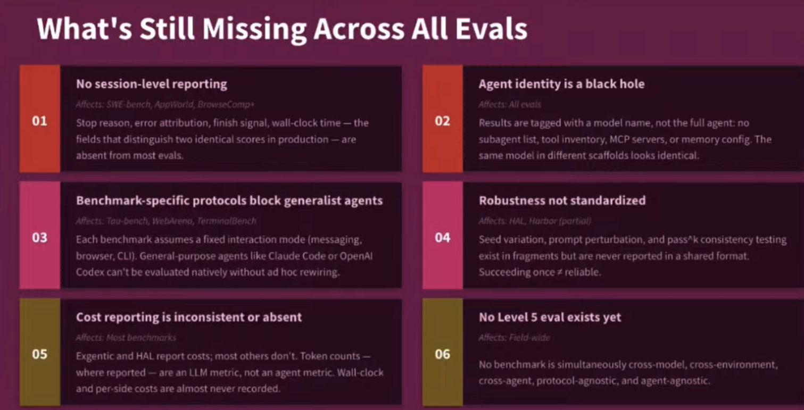
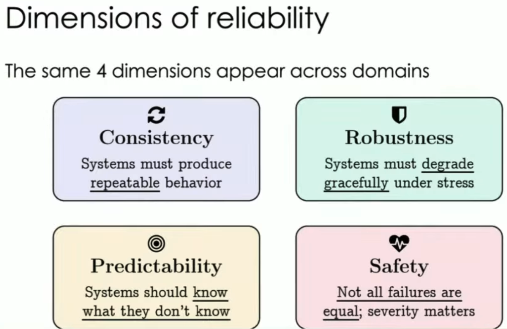
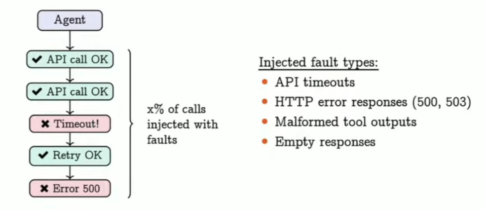
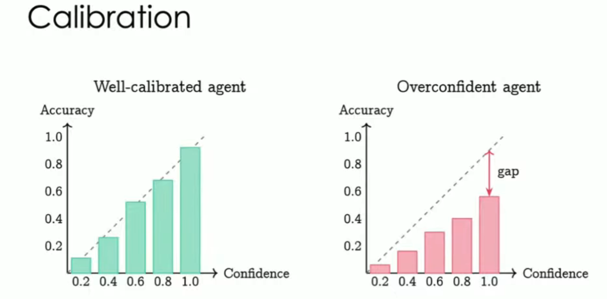
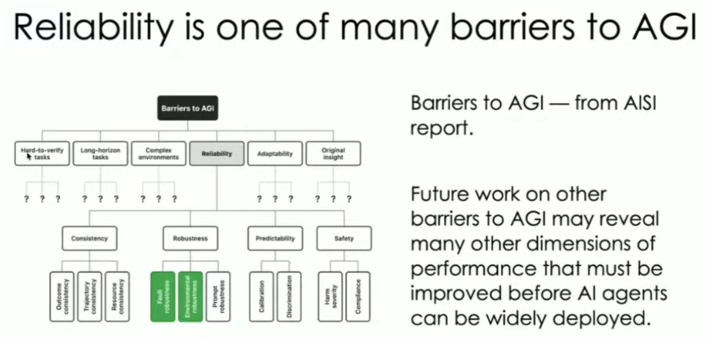
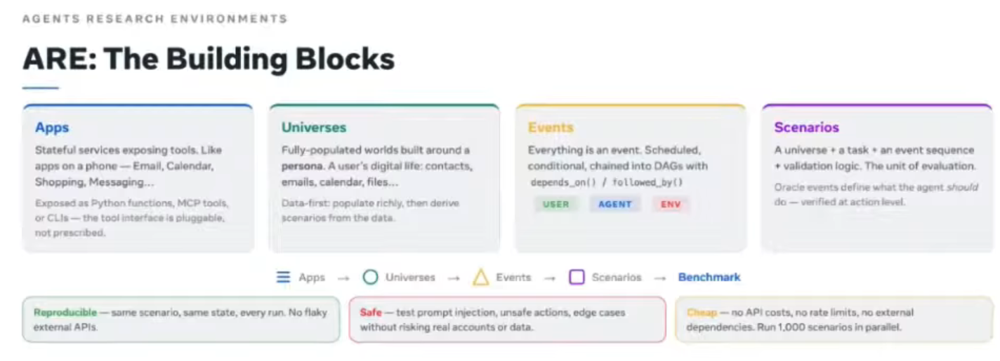
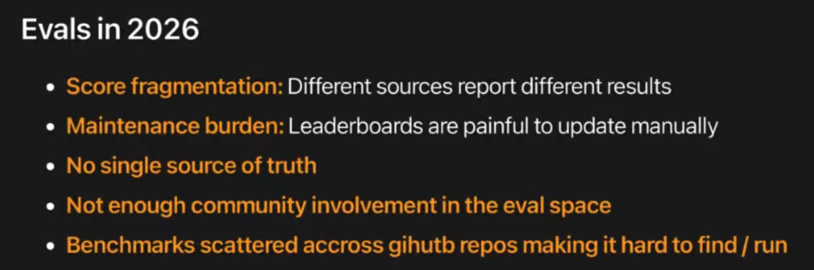

# Agent post training course hugging face

https://www.youtube.com/playlist?list=PLo2EIpI_JMQvQZm-kVlz4wY1vWF0LBcf5

# Problems in evals.
benchmark maxing - openAI
not reporting error bars.

Every eval every by hugging face -- In order to collect evals data in consistent format 
we need honest and not gamefied evals reporting.

# State of Agentic evals
Benchmarks are mutual Incompatible

for examples : tau-Bench , web-arena , terminal-bench

# Whats missing in agent evals

paper by IBM about agentic aystmes should be general called **exgenic** agents that are harness agnostic.

# AI agents reliability.

If agents are very capable why , there is no economic impact yet ?
one explanation is It will take more time , other is there is compactability and **relability** gap . no benchmark is reporting economic impacts.

Consitency :
run each task k times how similar is the runs ?

fault Robustness:

prompt robustness:
preparing postite and negative prompts for the agents.

calibration: Measures how under or overconfident the agent is ?

# Barriers to AGI

# ARE - agent research enviroenmt for measuring dynamic environments

how reward hacking looks like in gaiai and what they did to check it ?

Hard verifiers : algorothmix checks.

# Bespoke labs : Agentic Evaluations using Environments.

1) How not to evals agent.
- Vibe evals.

2) why agent evals are hard
- Stochastic : two runs can produce different results
- Sequential : many steps of preogress
- Interaction  with real world and tools.

3) How to setup environments for evals
- verifiable :
   - examples : did the unit test case pass , is the final result correct ?
   - for unit tests : should we give equal weightage to the test ?
   -  did the agent try to reward hack ?

- Rubrics:
    for non verifiable tasks like deep research agent we can define various rubrics.

- Environments:
    Define Grader , prevent reward hacking.

- Metrix :
    - Primary metrix : 
        Sucess rate , pass@k , pass^k
    - Efficiency :
        Steps , token count , latency and cost
    
# Evals in 2026 :

Learn Inspect-ai evaluation framework.

long horizon agentic evaluations. SwissAI

